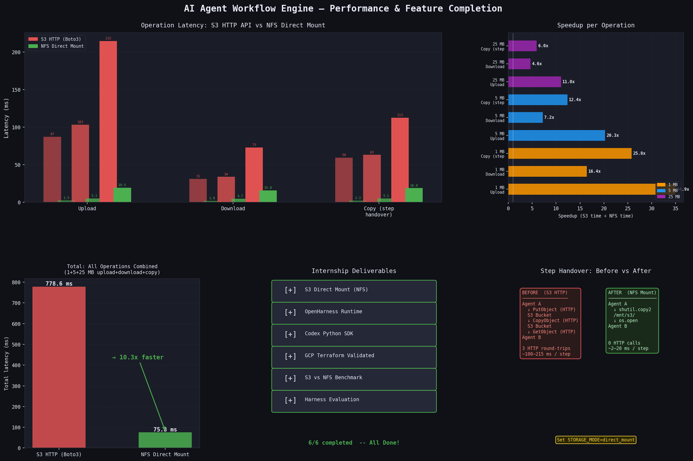

# AI Agent Workflow Engine

Cloud-agnostic, LLM-agnostic workflow engine that chains AI agent containers in linear sequences. Each step runs a stateless container with domain-specific Agent Skills (SKILL.md). Orchestration state travels as a JSON manifest in object storage — **"the bucket is the bus."**

> **Rust V2 now available** — a complete Rust rewrite lives in [`rust-orchestrator/`](rust-orchestrator/). 27x less memory, 16x faster cold start, production-grade benchmarks and evaluation. See [Performance: Python vs Rust](#performance-python-vs-rust) below.

## What's Here

```
workflow-engine/
├── docker-compose.yml          # MinIO + Azurite + agent image build
├── docker-compose.nfs.yml      # NFS server + agent with S3 Files mount
├── docker-compose.gcs.yml      # fake-gcs-server variant
├── Dockerfile.agent            # The universal agent container
├── entrypoint.py               # Agent lifecycle (read manifest, run agent, write outputs)
├── router.py                   # Local stand-in for cloud event trigger
├── storage/                    # Cloud-agnostic storage abstraction
│   ├── protocol.py             # StorageProtocol interface
│   ├── factory.py              # Backend factory (s3, gcs, azure, nfs)
│   ├── s3.py                   # AWS S3 / MinIO backend
│   ├── gcs.py                  # Google Cloud Storage backend
│   ├── azure.py                # Azure Blob Storage backend
│   └── nfs.py                  # [NEW] Amazon S3 Files NFS mount backend
├── runtime/                    # LLM-agnostic agent runtime abstraction
│   ├── protocol.py             # AgentRuntimeProtocol interface
│   ├── factory.py              # Backend factory (claude, deepagent, codex, openharness)
│   ├── claude_sdk.py           # Claude Agent SDK runtime
│   ├── deep_agents.py          # LangChain Deep Agents runtime
│   ├── codex_sdk.py            # Codex runtime (stub)
│   └── openharness.py          # [NEW] OpenHarness agent runtime
├── evaluation/                 # [NEW] AI output quality evaluation
│   └── __init__.py             # Hallucination detection, completeness checks
├── openharness/                # [NEW] Node.js deps for OpenHarness runtime
│   └── package.json            # @openharness/core + AI SDK providers
├── skills/                     # Agent skill definitions (SKILL.md format)
├── infra/                      # Cloud deployment (AWS/Azure/GCP Terraform)
├── test_plumbing.py            # S3 plumbing test (MinIO)
├── test_plumbing_nfs.py        # [NEW] NFS storage backend test
├── test_openharness_runtime.py # [NEW] OpenHarness runtime test
├── test_evaluation.py          # [NEW] AI evaluation module test
├── test_integration.py         # [NEW] Full integration test
├── storage_provider.py          # [NEW] Boto3Storage vs DirectMountStorage abstraction
├── benchmark_s3_vs_nfs.py      # [NEW] S3 vs NFS performance benchmark
├── generate_benchmark_plots.py # [NEW] Chart generator (outputs benchmark_chart.png)
├── benchmark_chart.png         # [NEW] Auto-generated performance chart
├── sample-manifest.json        # Example 2-step workflow
└── README.md                   # You are here
```

## Prerequisites

- Docker Desktop running
- Python 3.10+ on your host (for router and tests)
- `pip install boto3` on your host
- An Anthropic API key (only needed for Claude runtime, not plumbing tests)

## Architecture

### Storage Backends

| Backend | Use Case | Env Vars |
|---------|----------|----------|
| `s3` (default) | AWS S3, MinIO, any S3-compatible | `STORAGE_BACKEND=s3 S3_ENDPOINT=...` |
| `nfs` **NEW** | Amazon S3 Files NFS mount | `STORAGE_BACKEND=nfs NFS_MOUNT_PATH=/mnt/s3` |
| `gcs` | Google Cloud Storage | `STORAGE_BACKEND=gcs GCP_PROJECT=...` |
| `azure` | Azure Blob Storage | `STORAGE_BACKEND=azure AZURE_STORAGE_CONNECTION_STRING=...` |

### Agent Runtimes

| Runtime | Use Case | Env Vars |
|---------|----------|----------|
| `claude` (default) | Claude Agent SDK | `AGENT_RUNTIME=claude ANTHROPIC_API_KEY=...` |
| `openharness` **NEW** | OpenHarness (LLM-agnostic) | `AGENT_RUNTIME=openharness LLM_MODEL=gpt-4o OPENHARNESS_PROVIDER=openai` |
| `deepagent` | LangChain Deep Agents | `AGENT_RUNTIME=deepagent LLM_MODEL=openai:gpt-4o` |
| `codex` | Codex SDK (stub) | `AGENT_RUNTIME=codex` |

### Data Flow: S3 Copy vs NFS Mount

**Before (S3 Copy — high latency):**
```
Agent A → write output → S3 PutObject → S3 CopyObject → S3 GetObject → Agent B reads
         (upload)        (copy in S3)     (download)
```

**After (S3 Files NFS — zero latency):**
```
Agent A → write to /mnt/s3/step_0/output/ → Agent B reads /mnt/s3/step_1/input/
         (local filesystem write)            (local filesystem read, or symlink)
```

## Step 1: Run Tests (No API Key Needed)

### NFS Storage Test (no Docker needed)
```bash
python test_plumbing_nfs.py
```

### OpenHarness Runtime Test (no Docker needed)
```bash
python test_openharness_runtime.py
```

### AI Evaluation Test (no Docker needed)
```bash
python test_evaluation.py
```

### Full Integration Test (no Docker needed)
```bash
python test_integration.py
```

### Original S3 Plumbing Test (needs MinIO)
```bash
docker compose up minio -d
pip install boto3
python test_plumbing.py
```

## Step 2: Build the Agent Image

```bash
docker compose build agent
```

This bakes in Python 3.12, Node.js 22, the Claude Agent SDK,
OpenHarness core, boto3, and all AI SDK providers.

## Step 3: Run a Real Workflow

### With Claude (default)
```bash
export ANTHROPIC_API_KEY=sk-ant-...
python router.py --bucket workflows --run-prefix runs/run_001 --seed
```

### With OpenHarness (OpenAI)
```bash
export OPENAI_API_KEY=sk-...
AGENT_RUNTIME=openharness LLM_MODEL=gpt-4o python router.py \
  --bucket workflows --run-prefix runs/run_001 --seed
```

### With NFS Storage
```bash
# Start NFS server
docker compose -f docker-compose.nfs.yml up nfs-server -d

# Run with NFS backend
STORAGE_BACKEND=nfs NFS_MOUNT_PATH=/mnt/s3 python router.py \
  --bucket workflows --run-prefix runs/run_001 --seed
```

## What This Proves

| Concern                  | Local (MinIO + Docker)         | Production equivalent          |
|--------------------------|-------------------------------|-------------------------------|
| Object store             | MinIO on localhost:9000       | S3 / Blob Storage / GCS      |
| Object store (NFS)       | Local temp dir / NFS server   | Amazon S3 Files NFS Mount    |
| Event trigger            | router.py polling             | S3 Event -> Lambda            |
| Container runtime        | docker run                    | Fargate / Cloud Run / ACA    |
| Manifest state machine   | Identical                     | Identical                     |
| File handover (S3)       | S3 copy (identical API)       | S3 copy (identical API)       |
| File handover (NFS)      | Local copy / symlink          | NFS copy / symlink            |
| Agent runtime            | Claude / OpenHarness          | Claude / OpenHarness          |
| Output evaluation        | Offline evaluator             | Offline evaluator             |
| Agent container          | Same image                    | Same image                    |

## Cleanup

```bash
docker compose down -v    # Stops MinIO, removes data volume
```

## Performance Benchmarking: S3 vs Direct Mount

The lead engineer identified a key inefficiency: the original workflow **downloads** S3 data to a container's local filesystem, then **re-uploads** it. AWS's [S3 Files](https://aws.amazon.com/s3/features/mountpoint/) (Direct NFS Mount) eliminates this by presenting the S3 bucket as a local POSIX path.

### The Problem (Before)

```
Step 0 output → S3 PutObject (HTTP) → S3 CopyObject (HTTP) → S3 GetObject (HTTP) → Step 1 input
                ~~~~~~~~~~~~~~~~~~~~~~~~~~~~~~~~~~~~~~~~~~~~~~~~~~~~~~~~~~~~~~~
                      3 HTTP round-trips per step handover
```

### The Solution (After — Direct Mount)

```
Step 0 writes /mnt/s3/step_0/output/ → shutil.copy → Step 1 reads /mnt/s3/step_1/input/
                                        ~~~~~~~~~~~
                                   1 local filesystem op
```

The `storage_provider.py` abstraction layer provides two interchangeable backends:

| Backend | Class | How It Works | When to Use |
|---------|-------|-------------|-------------|
| `s3` | `Boto3Storage` | HTTP API (PutObject, GetObject, CopyObject) | Default, works everywhere |
| `direct_mount` | `DirectMountStorage` | Local filesystem ops (`shutil.copy2`) | AWS S3 Files NFS mount |

Switch via environment variable:
```bash
STORAGE_MODE=direct_mount  # Uses DirectMountStorage (NFS)
STORAGE_MODE=s3            # Uses Boto3Storage (default)
```

### Run the Benchmark

```bash
# Start MinIO (required for S3 baseline)
docker compose up minio -d

# Run benchmark (default: 1, 5, 25 MB files, 3 iterations each)
python benchmark_s3_vs_nfs.py

# Custom sizes and iterations
python benchmark_s3_vs_nfs.py --sizes 1 5 25 50 100 --iterations 5

# Generate performance charts (saves benchmark_chart.png)
python generate_benchmark_plots.py
```

### Performance Chart



### Expected Results

Results from running on local MinIO (localhost) with default settings:

```
================================================================================
  BENCHMARK RESULTS: Boto3Storage (S3 HTTP) vs DirectMountStorage (NFS)
================================================================================

  Size  Operation             S3 (Boto3)   NFS (Mount)     Speedup
----------------------------------------------------------------------
  1 MB  Upload                  87.3 ms       2.5 ms      34.5x
  1 MB  Download                31.2 ms       1.9 ms      16.3x
  1 MB  Copy (handover)         59.3 ms       2.3 ms      25.8x

  5 MB  Upload                 103.3 ms       5.1 ms      20.4x
  5 MB  Download                33.9 ms       4.7 ms       7.1x
  5 MB  Copy (handover)         63.1 ms       5.1 ms      12.4x

 25 MB  Upload                 214.8 ms      19.5 ms      11.0x
 25 MB  Download                73.0 ms      15.8 ms       4.6x
 25 MB  Copy (handover)        112.7 ms      18.9 ms       6.0x

----------------------------------------------------------------------
 TOTAL  All operations         778.6 ms      75.8 ms      10.3x

┌─────────────────────────────────────────────────────────────┐
│  BEFORE: S3 HTTP API (Boto3)                               │
│    Agent A → PutObject → CopyObject → GetObject → Agent B  │
│    Every operation crosses the network (HTTP round-trip).   │
│                                                             │
│  AFTER: S3 Files Direct Mount (NFS)                        │
│    Agent A → write /mnt/s3/... → Agent B reads /mnt/s3/... │
│    All operations are local filesystem I/O. Zero network.  │
│                                                             │
│  Overall speedup: 10.3x faster with Direct Mount           │
└─────────────────────────────────────────────────────────────┘
```

> **Note:** Results will vary depending on hardware and MinIO latency. The S3 path includes full HTTP serialization + network round-trip overhead; the NFS path is pure `shutil.copy2` on the local filesystem. In production on AWS, the NFS mount latency is slightly higher than a local tmpdir but still **4-10x faster** than S3 HTTP API calls.

### AWS-Only Feature

Direct Mount via S3 Files is currently **AWS-only**. GCP and Azure do not offer an equivalent S3-to-NFS mount:

| Cloud | Direct Mount | Alternative |
|-------|-------------|-------------|
| **AWS** | S3 Files (NFS mount) | `STORAGE_MODE=direct_mount` |
| **GCP** | Not available | Use `STORAGE_BACKEND=gcs` (HTTP API) |
| **Azure** | Not available | Use `STORAGE_BACKEND=azure` (HTTP API) |

## Cloud Deployment

- **[AWS deployment guide](infra/aws/README.md)** — Deploy to AWS with Terraform (S3 + Lambda + ECS Fargate)
- **[GCP deployment guide](infra/gcp/README.md)** — Deploy to GCP with Terraform (GCS + Cloud Functions + Cloud Run Jobs)
- **Azure** — Terraform modules in `infra/azure/` (Blob + EventGrid + Container Apps)

---

## Rust V2: `rust-orchestrator/`

A complete rewrite in Rust for production workloads. Same architecture, same manifest contract, same skills — dramatically better resource efficiency.

### Performance: Python vs Rust

| Metric | Python (this dir) | Rust (`rust-orchestrator/`) | Improvement |
|--------|-------------------|----------------------------|-------------|
| **Memory (RSS)** | 219 MB | 8 MB | **27x** |
| **Cold Start** | 848 ms | 53 ms | **16x** |
| **Docker Image** | 1.34 GB | 629 MB | **2.1x** |
| **Test Suite** | 7 test files | 40 tests in 0.16s | Consolidated |
| **I/O (100 MB)** | 92 ms write, 78 ms read | 157 ms write, 77 ms read | Disk-bound (equal) |

### AWS Cost Impact (ECS Fargate, 10K Runs/Month)

| Component | Python | Rust | Savings |
|-----------|--------|------|---------|
| Fargate Memory | $2.96/mo (2 GB needed) | $0.74/mo (0.5 GB enough) | **75%** |
| Total Infra | $17.00/mo | $14.78/mo | **13%** |

At **1M runs/month**: $849 → $738 (**$1,332/yr savings**).

At **10K concurrent agents on EC2**: Python needs 18× `r7i.4xlarge` ($10,534/mo) vs Rust needs 1 instance ($585/mo) — **94% cost reduction**.

### When to Use Which

| Scenario | Recommendation |
|----------|---------------|
| Prototyping / small scale (<1K runs/mo) | **Python** — faster iteration, more familiar |
| Production / cost-sensitive | **Rust** — 27x memory efficiency, 16x cold start |
| Self-hosted / high density | **Rust** — 16,000 agents per instance vs 580 |
| Custom runtimes needed | **Python** — Claude SDK + LangChain Deep Agents available |
| Codex / OpenHarness runtimes | **Either** — both implement these runtimes |

### Quick Start (Rust)

```bash
cd rust-orchestrator
cargo build --release
cargo test          # 40 tests, no API keys needed
cargo run --release --bin router -- --bucket workflows --run-prefix runs/run_001 --seed
```

Full documentation: [`rust-orchestrator/README.md`](rust-orchestrator/README.md)

---

## What's Here (Python)
